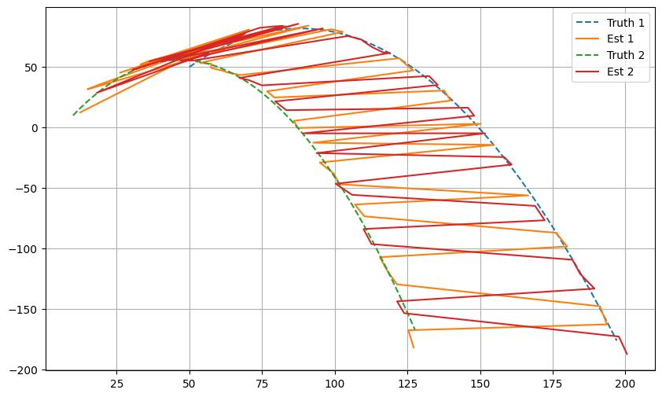

# Particle Filter for Ball position prediction

Solution of undistinguishable ball assignment problem for Portfolio 2 of **Reasoning and Decision-Making under Uncertainty**

## Author: Peter Möhle, Christopher Reinard Kohar

# Installation and Testing

1. Install required libraries from requirements.txt
2. Alter the Variables on Cell 4 of either of the Jupyter Notebook
3. Look at the results

# Explanations of Class Files

Below are quick explanations of the purpose of each file in the classes directory

## observation.py

- Contains the Observation_Model and the Transition_Model

### Observation_Model

- Outputs the observations
- Computes the likelihood of the particle given the observations

### Transition_Model

- Moves the states to new states
- Physics model given
- Noise model wasnt given:
  - First Idea: Applying the same process_noise on all coordinates ([x,y,vx,vy])
    - Problem: Not Physical correct. Dimensionalities have different units. Noise should be approproate in respect to all Coordinates
  - Later Solution: 'Continuous-Time White Noise Acceleration model'. Process_noise mutliplied according to physics on each coordinate.

## particle_filter_multiple.py (Christopher)

### Main Idea: 1 single-ball filter for each ball

- Problem to solve: given n estimates and n observations, how do we assign which filter to each ball?
  - Chosen Solution was to compute distances between each ball (Mahalanobis, Euclidean)
  - Minimize the distance with linear_sum_assignment from scipy

### Advantage

(Get info about performance, runtime, and hyperparameter search from tests)

### Disadvantage

## particle_filter.py (Peter)

Main Idea: Use 1 filter for all the balls

## classifier.py

- Evaluates the likelihood of a point given a gaussian

## evaluator.py

- To evaluate the distance of the balls, assigning the balls is necessary.
- Gets the distance between the true location and estimates, then assigns the minimum distance between them as the loss
- When all estimates are at the same location of the true location, distance would be 0

## plotting.py

Contains plotting functions that allow for visualizations and animation to evaluate results

particle_filter.py and particle_filter_multiple.py

## Explanation of Pipeline

## Ideas Explored

1. Use of a single Particle Filter for all balls
   - Exploration of using a Gaussian Mixture Model to predict ball location from the particles
2. Use of Multiple Particle Filters for each ball
   - Use of Mahalanobis Distance

## Tests Run

1. Increasing number of balls (Performance)
